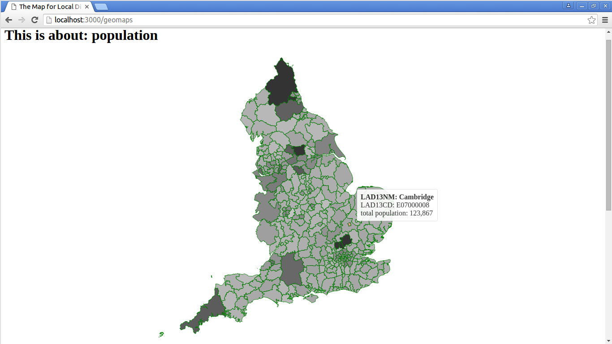

# LDAs choropleth map

This project shows a choropleth map of England break down by Local District Authorities using D3.js as the mapping framework. 
When the mouse hover on a LDA a tooltip shows up with aggregated information about that LDA.

# Run the code

This has been tested with node version 5.3.0 using `nvm` (Node Version Manager).

## Frontend dependencies

The frontend javascript dependencies are managed with bower. To install it you need node.js, then you can run:

```
cd code
npm install -g bower
bower install
```
For more details cfr. the file `code/bower.json`.

## Backend dependencies

The project is a node.js application. The node.js dependencies could be installed running:
```
cd code
npm install
```
For more details check the file `code/package.json`

## Runtime

Assuming `nvm` and/or `node` available from the command line, you can run the project with:
```
./code/bin/www
```
then visiting: `http://localhost:3000/geomaps/`

When the mouse hover on a LDA the tooltip it shows the population for that district.
The population amount has been scaled in colour range that is shown on the area of each district.
The data regarding the shapes for the LDAs (Local District Authorities of England) has been picked from this repository: [https://github.com/martinjc/UK-GeoJSON](https://github.com/martinjc/UK-GeoJSON).
The data regarding the population has been found on this Government's statistics website: [https://www.gov.uk/government/uploads/system/uploads/attachment_data/file/389344/RUC11_LAD11_EN.csv](https://www.gov.uk/government/uploads/system/uploads/attachment_data/file/389344/RUC11_LAD11_EN.csv).



