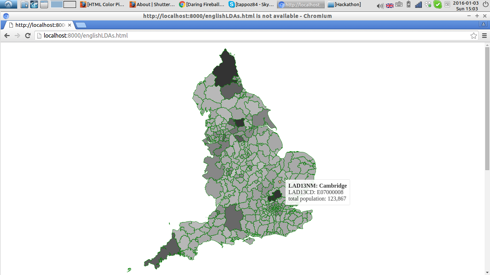

# LDAs choropleth map

This project shows a choropleth map of England break down by Local District Authorities using D3.js as the mapping framework. 
When the mouse hover on a LDA a tooltip shows up with aggregated information about that LDA.

# Run the code

## JS dependencies

The frontend javascript dependencies are managed with bower. To install it you need node.js, then you can run:

- `npm install -g bower`
- `bower install` to install the dependencies (cfr. the file `bower.json`)

This has been tested with node version 5.3.0 using `nvm` (Node Version Manager).

## Runtime

You can run the project using python serving the static HTML / javascript with:
```
python -m SimpleHTTPServer 8000
```
then visiting: `http://localhost:8000/englishLDAs.html`

When the mouse hover on a LDA the tooltip it shows the population for that district.
The population amount has been scaled in colour range that is shown on the area of each district.
The data regarding the shapes for the LDAs (Local District Authorities of England) has been picked from this repository: [https://github.com/martinjc/UK-GeoJSON](https://github.com/martinjc/UK-GeoJSON).
The data regarding the population has been found on this Government's statistics website: [https://www.gov.uk/government/uploads/system/uploads/attachment_data/file/389344/RUC11_LAD11_EN.csv](https://www.gov.uk/government/uploads/system/uploads/attachment_data/file/389344/RUC11_LAD11_EN.csv).



